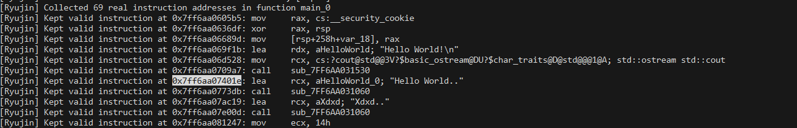

# Ryujin RE

This project is a study based on my friend keow's ryujin code, we built a small plugin to remove 
junkcode and the like from the Ryujin VM using IDA pro

Github - [Ryujin Protector](https://github.com/keowu/Ryujin)

## About 

You can use command lines using the [ida-domain](https://github.com/HexRaysSA/ida-domain) recently implemented by HexRays, 
and you can use it within IDA as a plugin as well.

## Running the cli

Simple command using cli to clean junkcode from a function

```python
python .\cli.py -f DemoObfuscation.ryujin_dump.exe  --target-ea 140697391191823
```

